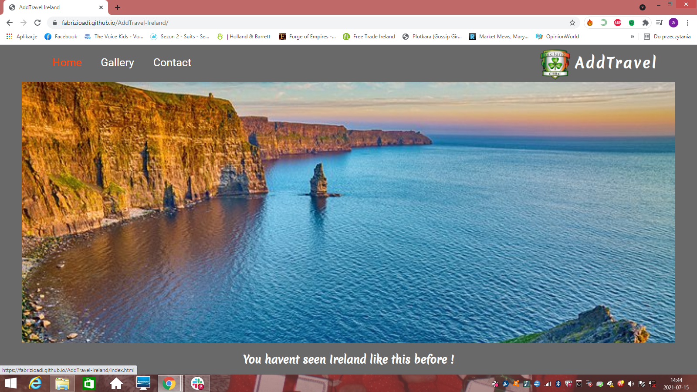
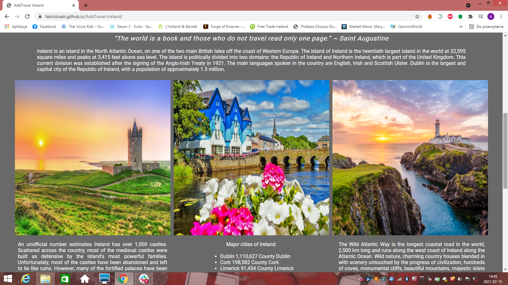
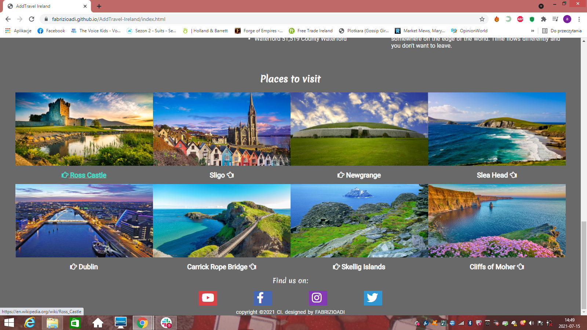
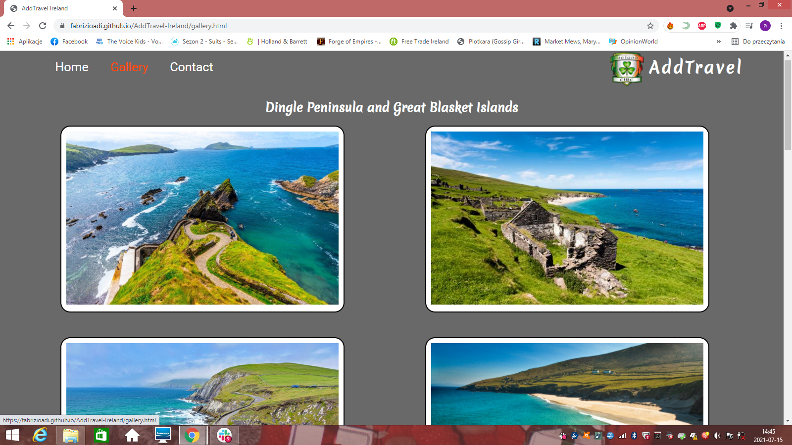
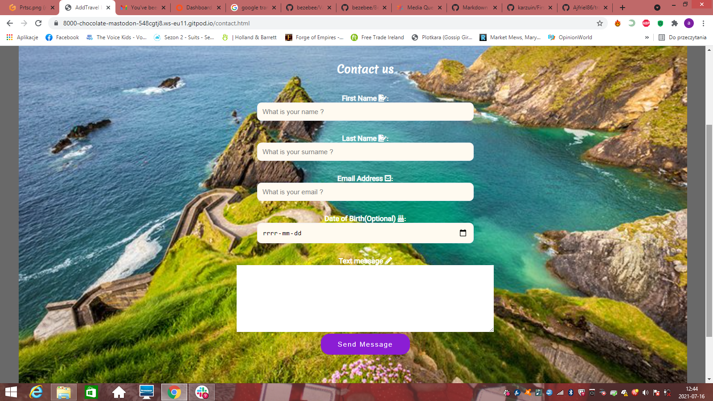

# Introduction - Add Travel Ireland
[I am the link to the website](https://fabrizioadi.github.io/AddTravel-Ireland/)
Hello good people !

 A website for people who would like to coming on hollidays to Ireland. Also for people who would like to know more about Green Island and its most beutiful places. This website promotes tourism, gives ideas and information with little bit general knowledge, basically encouraging sightseeing.

 I wanted to create a simple project with little text, I hope I did it. In my opinion people as myself don’t like busy looking websites, where is lots of text to read. I may be wrong but should the website look like a book to read? :) I like simplicity and beauty.

From the beginning of my adventure with coding the first idea for a website was a travel site. Simple because I like traveling a lot and I stayed with that idea. I managed to see most of the presented places, so it was easier for me to search and add information and photos. The website's logo idea was created from the first letters of my name, plus the word Travel. I can't yet create an appropriate drawing logo myself, so I used a google image logo. Although the most suitable logo would still be the palm logo.

### Table of Contents
- [Introduction - Add Travel Ireland](#introduction---add-travel-ireland)
    + [Table of Contents](#table-of-contents)
  * [Goals](#goals)
  * [Description](#description)
      - [Website Contain](#website-contain)
  * [User journey](#user-journey)
  * [Features](#features)
  * [Technologies](#technologies)
  * [Deployment](#deployment)
      - [Step to Using Github Pages](#step-to-using-github-pages)
      - [Run Locally](#run-locally)
  * [Useful Links](#useful-links)
  * [Images](#images)
  * [Commands](#commands)
  * [Conclusion](#conclusion)
  * [Reference Links](#reference-links)
  * [Author Info](#author-info)

<small><i><a href='http://ecotrust-canada.github.io/markdown-toc/'>Table of contents generated with markdown-toc</a></i></small>

## Goals
The main goal of the website was to present Ireland in an eye-catching way. I would even say fabulous way. Through this website people will be able to find ideas for travel and leisure activities.

## Description
We Live to Travel. 
Is one of my slogans, because what else to do with our free time. Not including coding.
The main purpose of the website is to promote tourism, to show the wildest and most beutiful places in Ireland.
We have to remember that everything can be an attraction: monuments, cliffs, a good restaurant, a bicycle trail, canoeing, a vantage point, a forest, a ruin or a town nearby.
On this website I want to present information, photos and locations of interesting places that are worth to seeing.

You havent seen Ireland like this before !

#### Website Contain
* **Home page**
* **Gallery (Photos)**
* **Contact page**

The website consists of a three pages: home page, gallery, contact. 
1. The home page presents general information about the Ireland its largest cities, castles, the coastline with amazing cliffs, which are undoubtedly one of the most amazing attractions. There are also links to other places worth seeing, referring to wikipedia for more information. 
2. The gallery page contains mainly photos from selected places. 
3. Contact page as the name suggests, it is supposed to enable contact. Collect opinions and ideas. The user and the people visiting the website can have the most say in this matter. This will help meet people expectations in the future and help change the website to make it better. 

At the end of each page you can find links to social media. The entire website design contains a lot beautiful quality photos, photos that were supposed to present to Ireland in a magical way.

## User journey
* The user begins his adventure on the home page. There they will find a background image with a moving information frame. In the upper left corner there is an menu for navigating to other website pages. In the upper right corner you can find a logo with a photo.
On this website you will find general information about Ireland and places worth to seeing.

* Scrolling down to the next section of home page shows images and divided sections presenting general information about castles, towns and the coast.

* The next section when scrolling down, present Places to visit where user can find more photos of places worth seeing. Below the picture there is the name of the place that can be clicked to get more information from the website connected to it (mainly wikipedia). Clicking on the place name is also decorated with the index finger from the google font.
At the bottom of the page user can find the social media links. Links should open in a new tab, transferring successively to youtube, facebook, instagram or twitter.

* Gallery page, as the name suggests, contains photos with the title of selected places in Ireland. At the top there is a navigation menu with a logo and below there are links to social media. Photos are wrapped in a frame to resemble wall photos or photos taken with an older cameras.

* The last page is the contact page. This section allows user to contact. Main idea is gather opinions and ideas. This should help meet user expectations in the future and help to change website to make it better.

#### User stories

1. As a user, I would like to be able to access the site on diffrent devices, so I want to see the website on my phone or tablet.
2. As a user, I want to be able to contact the publisher of the site so I can get more information or leave a fedback.
3. As a user, I want to view a list of places, so I can select most interesting one.
4. As a user, I want to see place name or where the displayed place is, so I can located on the map.
5. As a user, I want to find out more about Ireland introduced on the Home page.
6. As a user, I want an easy to navigate website to save time and not get frustrated or lost.

## Features
All three pages contain a navigation menu bar in the upper left corner where you can click to go to any of the three pages. I decided to put the navigation menu on the top left and the logo on the right, because most of the pages I am viewing are reversed and are sort of a standard. 
Three pages also contain the same footer with stylized social media in it with a corresponding color.
The main text fonts are Roboto, sans-serif; and for hedings I used merienda, coursive both fonts work very well with each other.
The entire page have background-color: dimgray; text color: white; the idea for such a choice of colors was the CI template in gitpod. And it is also a stepping stone from some sort of standard white page with black text.

I never know if a zebra is white with black stripes or black with white stripes :)

#### Index.html (Home)
The navigational menu turns white when hovering over it, and the logo also turns green.
This page has a non moving background photo. This creates a nice visual effect of the page sliding over to this photo. Which also looks like it is winding up. The truth is I created this effect quite accidentally while playing with the codes. This photo presents one of the most popular places in Ireland, the cliff of moher, which attracts many visitors. 

On the scrolling frame there is a quote and description about Ireland as a country, an island. Then user can find a three examples of diffrent landscapes. Presenting interesting facts about castles, cities and the coast of Ireland. The photos are placed next to each other in stylized rectangular divs named image1, image2, image3.

Section Places to visit contains eight photos named photo with numbers up to 8. On the main page at a resolution of 1500px photos are placed next to each other. On the tablet there are two columns separated by a page body background color. Below on the name of the place, we will move to wikipedia pages where we can find out more. The links turns light blue on hover: P I'm a man, so white is white and black is black :D links is also indicated with a finger from google font awsome.

So finally we are on the bottom of my page, here we can find links to social media with icon from google font, which I tried to put in small squares with the original color, which I found by typing in the google search engine. Of course, the links take us where they should.

#### Gallery.html (Gallery)
The gallery page is not too complicated, although it took a lot of work. Because the first idea of ​​arranging the photos was the idea of ​​arranging them in variations, two photos next to three with descriptions divided into two columns. Photos below were to have different layouts. After a few tries, I put four photos next to each other. But after consulting with my mentor, I decided to enlarge the photos and arrange them in two columns. As already mentioned photos are wrapped in a frame to resemble wall photos or photos taken with an older cameras.

#### Contact.html (Contact)
Contakt page contains a backgroun image on which the contact form is placed. The form's frames are slightly rounded.
Input contain hints such as "What's your name?" After a few tries, I decided to leave a white frame with black text. Because the transparent or other colored frame does not blend well with the background photo. Send message button is purple to make it easier to see on the site.

## Technologies
* HTML - will help build a solid foundation.
* CSS - define the appearance of elements and their design.
* Balsamic.com - Wireframes
* Gitpod - Container based development platform. Ready-to-code development environments in the cloud accessible through your browser    and your local IDE.
* Github - The most popular of the websites that host Git repositories in the cloud. Thanks to a service like GitHub, we can share our code with other developers and work with them remotely over time.
* W3C HTML Valitator - HTML Validator
* W3C CSS Validator - CSS Validator
* Google Font Awsome - Very resource rich service offered by Google
* Google images

## Deployment
#### Step to Using Github Pages
1. In the GitHub Repository from the project: https://github.com/FabrizioAdi/AddTravel-Ireland
2. Click the "Settings" Tab.
3. Scroll Down to the Git Hub Pages Heading.
4. There will be a message - Pages settings now has its own dedicated tab! press the - Check it out here!
5. Select "Master Branch" as the source.
6. The Page will reload "Settings" again.
7. Scroll to GitHub pages heading and there will now be a clickable link to the website: https://fabrizioadi.github.io/AddTravel-Ireland/
8. Click this link for the live deployed website.

#### Run Locally
1. In the GitHub Repository from the project: https://github.com/FabrizioAdi/AddTravel-Ireland
2. Click Clone or Download
3. Copy Git URL from the dialogue box
4. Open your developement editor of choice and open a terminal window in a directory of your choice
5. Use the 'git clone' command in terminal followed by the copied git URL
6. A clone of the project will be created locally on your machine

## Useful Links
[I'm compare your own code to the source code and highlight the differences between them.](https://www.diffchecker.com)

[I'm an explanation what is semantic markup.](https://html.com/semantic-markup)

[I'm a HTML/CSS style guide for students](https://www.granneman.com/webdev/coding/html-css-style-guide-students#css-style-rules)

[I'm organizing files and folder structure for web pages](https://stuyhsdesign.wordpress.com/basic-html/directory-structure)

[I'm google fonts used to change text](https://fonts.google.com)

[I'm an example of google fonts](https://developers.google.com/fonts/docs/getting_started)

[I'm an web's most popular icon set and toolkit.](https://fontawesome.com)

[I'm box shadow generator - I give you a code :)](https://html-css-js.com/css/generator/box-shadow/)

## Images
Here's our logo 

## Commands
To browse the pages, in the terminal, type: python3 -m http.server

## Conclusion
Creating a website is an adventure and a real challenge. The greatest joy, however, is the moment when everything that has been done works without any problems :P Reflecting on the whole aspect of the website, I know that I could have made the code clearer and more readable. I jumped too much around the code, introducing too many changes, which made me a bit lost and some things I did not have time to fix, such as media query for the tablet, some things work properly, some not ... This is my first website after two months of study, it is a great lesson for the future. I am well aware that this is not a well made website and many things would have done differently. In my opinion, the website looks very good visually and that's what it's about.

## Reference Links
* I used Balsamiq to create wireframes in desktop, tablet and phone view. [Click me](https://balsamiq.com/)
* I used google image serch. All photos were found by this site. using terms such as: Ireland, most beutiful places, landscape, cities etc. [Click me](https://www.google.com/search?q=ireland&hl=en&tbm=isch&sxsrf=ALeKk034vrZ83U_C4_WYjYkJ1dlkB7ybqw%3A1626443730748&source=hp&biw=1600&bih=757&ei=0o_xYMvJK9O8gQayhY24CA&oq=ireland&gs_lcp=CgNpbWcQAzIECCMQJzIECCMQJzIFCAAQsQMyBQgAELEDMgUIABCxAzIICAAQsQMQgwEyAggAMgIIADICCAAyAggAUIAMWMoUYJgXaABwAHgAgAF6iAHgA5IBAzYuMZgBAKABAaoBC2d3cy13aXotaW1n&sclient=img&ved=0ahUKEwjL-sOG3-fxAhVTXsAKHbJCA4cQ4dUDCAc&uact=5)
* General information about Ireland [click me](https://en.wikipedia.org/wiki/Ireland)
* I mainly relied on CI and YouTube tutorials to create my codes.
1. [Markdown readme image](https://www.youtube.com/watch?v=hHbWF1Bvgf4&t=4s)
2. [Footer design](https://www.youtube.com/watch?v=zdA3qZNH1vc&t=338s)
3. [Add and style image](https://www.youtube.com/watch?v=_w6N_nplmAw)
4. [Background images](https://www.youtube.com/watch?v=33IinMVJf-M)
5. [Logo](https://www.youtube.com/watch?v=Wa_QmxwpFC8)
6. [Social media styling](https://www.youtube.com/watch?v=woVuUbDOeMk)
7. CI Learning Management System Tutorials

I am Jumping around and viewing many different type of tutorials, so should be much more links of them here, but honestly I don't even remember which one I watched.

#### Acknowledgements

Also thank you to the Code Institute slack channel, tutor Kasia and mentor Precious Ijege.

## Author Info
FabrizioAdi
